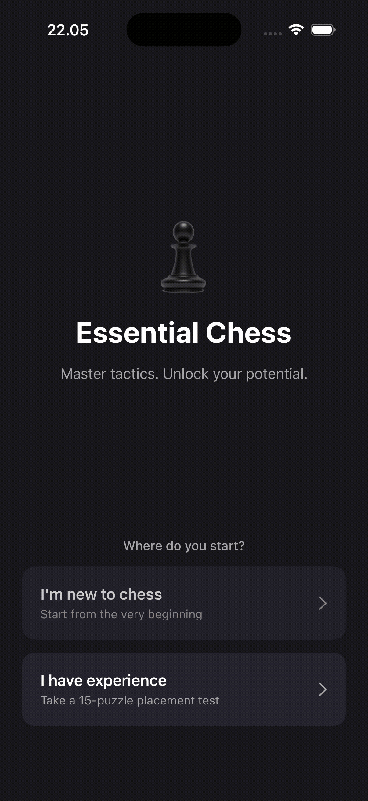

<p align="center">
  
</p>

# ♟️ Essential Chess: A Progressive Tactics Trainer


An offline-first, deeply gamified educational chess application designed to guide players through a structured, mastery-based tactical curriculum. This application eschews the overwhelming "firehose" of random puzzles found in traditional chess apps in favor of a linear, highly rewarding learning path.

Built with **Clean Architecture** and **MVVM**, this project demonstrates a strict separation of concerns—isolating pure domain logic from SwiftUI views and infrastructure. The app leverages **Combine** for reactive state management, highly decoupled ViewModels, and Behavior-Driven Development (BDD) specifications to handle complex progression logic, dynamic Elo rating calculations, and sudden-death exam mechanics.

---

## ✨ Key Technical Highlights

- **Clean Architecture:** Complete decoupling of the Domain layer, Presentation layer (SwiftUI/Dumb Views), and Data/Infrastructure layer (Adapters).
- **Reactive MVVM:** Pure ViewModels that manage state via Combine without importing UI frameworks or directly coupling to databases.
- **Offline-First:** The entire chess curriculum and puzzle engine run locally, driven by a robust JSON data architecture.
- **Behavior-Driven (BDD):** Core progression algorithms, the "99% Rule," rating calculations, and sequence navigations are backed by strict BDD testing scenarios using `XCTest`.
- **Catalyst Ready:** Fully optimized for iPadOS and macOS Catalyst with integrated `.hoverEffect(.highlight)` states and `.keyboardShortcut(.defaultAction)` integrations for seamless keyboard play.

---

## Table of Contents

* [1. Product Features & The Gamification Loop](#1-product-features--the-gamification-loop)
* [2. JSON Data Architecture (Single Source of Truth)](#2-json-data-architecture-single-source-of-truth)
* [3. Onboarding & Placement Test Flow](#3-onboarding--placement-test-flow)
* [4. Exam Gameplay & Endless Puzzle Mix](#4-exam-gameplay--endless-puzzle-mix)
* [5. Behavior-Driven Development (BDD) Specifications](#5-behavior-driven-development-bdd-specifications)
* [6. Core Swift Implementation (Clean Architecture)](#6-core-swift-implementation-clean-architecture)

---

## 1. Product Features & The Gamification Loop

The core philosophy is to provide a linear, gamified learning path with strict mastery checkpoints.

### The 3-Layer UI Hierarchy
* **Layer 1 (Section by Elo):** The main curriculum screen divided by rating brackets (e.g., 500-800, 800-1200). Higher sections are locked by default and strictly require passing the previous section's exam.
* **Layer 2 (Theme List):** Inside an unlocked section, users see specific tactical themes (e.g., Checkmates, Fundamental Tactics). Users can play these themes in any order. At the bottom of this list lies the Mix Puzzle Exam.
* **Layer 3 (Puzzle Board):** The actual interactive chess board where users solve specific tactical puzzles.

### The 99% Mastery Gate Rule
* Each Section and Sub-Theme has a visual progress bar.
* Completing puzzles inside standard themes updates the progress bar proportionally.
* Once all standard themes in a Section are 100% completed, the Section's overall progress bar strictly halts at **99%**.
* The remaining 1% (which acts as the trigger to unlock the next Elo Section) can only be achieved by passing the high-stakes **Mix Puzzle Exam**.

### Aesthetics & Customization
* **Board Themes:** Choose from Brown, Green, and Blue board designs.
* **Piece Styles:** Swap between Standard, Alpha, and Fantasy piece sets directly from the settings with dynamic visual previews.
* **Adaptive UI:** Beautiful Dark Mode support and tailored visual highlighting (e.g., `+15` rating gains in green, `-30` hint penalties in red).

---

## 2. JSON Data Architecture (Single Source of Truth)

To ensure maximum offline performance and simplicity, the entire curriculum is bundled into a single JSON file (`curriculum_final.json`). The data is structured hierarchically to perfectly match the UI layers.

### Clean Architecture: Domain vs. Presentation Models

The application employs Clean Architecture, separating pure domain data models from the reactive UI models.

```swift
// MARK: - 1. Pure Domain Models (Decoded from JSON)
public struct Curriculum: Codable {
    public let sections: [EloSection]
}

// MARK: - 2. Persistent State Model (User Defaults / Database)
public struct UserProgress: Codable {
    public var hiddenRating: Double
    public var actualRating: Double?
    public var completedPuzzleIDs: Set<String>
    public var passedExamIDs: Set<String>
    public var examFailureTimes: [String: Date]
}

// MARK: - 3. Presentation UI Models (Dumb Models for SwiftUI)
public struct SectionUIModel: Identifiable, Equatable {
    public let id: String
    public let title: String
    public let progress: Double
    public let isUnlocked: Bool
}
```

---

## 3. Onboarding & Placement Test Flow

### The Absolute Beginner Route
* If the user selects "I am new to chess", the placement test is skipped. The system assigns a base HiddenRating of 500, and only the first curriculum section is unlocked.

### The Experienced Route (Placement Test)
* If the user selects "I have some experience", they undergo a 15-puzzle assessment.
* **NO LIVES, NO COOLDOWN:** This is an assessment, not a punishment.
* **Dynamic Calibration:** The user starts at a provisional rating of 1000. Correct solves increase the rating and difficulty; incorrect solves decrease the rating and difficulty while showing the correct move.
* **Final Placement:** After 15 puzzles, the system permanently unlocks all Curriculum Sections up to that rating bracket.

---

## 4. Exam Gameplay & Endless Puzzle Mix

### The Mix Puzzle Exam Mechanics
The Mix Puzzle acts as the final exam for each Elo section.
* **Bank Randomization:** Randomly selects 10 puzzles from a hidden pool.
* **3-Lives Sudden Death:** The user is granted exactly 3 lives per exam attempt. Incorrect moves or tapping the "Hint" button deducts 1 life.
* **3-Hour Cooldown Penalty:** If the user loses all 3 lives, the exam is marked as "Failed", displaying a strict 3-hour countdown timer based on local device time to prevent brute-forcing.

### Train Tactics (Endless Puzzle Mix)
* **Infinite Replayability:** An endless stream of puzzles dynamically fetched based on the user's current `actualRating`.
* **Standard ELO Integration:** Uses the standard chess K-factor formula to compute rating changes instantly after each move.
* **Instant Visual Feedback:** Smooth micro-animations show rating deltas (e.g., a green `+15` on a successful solve or a red `-30` penalty for using a hint). 

---

## 5. Behavior-Driven Development (BDD) Specifications

Core algorithms are completely backed by Gherkin-style BDD tests.

```gherkin
Feature: Mix Puzzle Exam Gameplay, Lives, and Cooldown

Scenario: Depleting lives triggers a 3-hour cooldown
  Given the user is taking the exam with 1 life remaining
  When the user makes a mistake or uses a hint
  Then the lives counter drops to 0
  And the exam session immediately terminates
  And the system records the current timestamp as the failure time
  And the Mix Puzzle Exam button is locked with a 3-hour countdown timer

Scenario: Passing the exam synchronizes the progression
  Given the user correctly solves the 10th puzzle with at least 1 life remaining
  Then the Section's progress bar updates from 99% to 100%
  And the next sequential Elo Section becomes unlocked
```

```gherkin
Feature: Endless Puzzle Mix Gameplay and Dynamic Rating

Scenario: Initializing actual rating for the first time
  Given the user has a "hiddenRating" (e.g., 1350) from the placement test
  And the user's "actualRating" is currently null
  When the user opens the Puzzle Mix mode for the first time
  Then the system must initialize the "actualRating" to equal the "hiddenRating"
```

---

## 6. Core Swift Implementation (Clean Architecture)

State and side effects are managed through pure `ViewModels` and delegated to infrastructure via callback functions in the `AppComposer`.

### 6.1 Exam Gameplay Engine (`ExamViewModel`)
Handles 3-lives sudden death without coupling to UI layers.

```swift
public final class ExamViewModel: ObservableObject {
    public enum ExamPhase { case active, passed, failed }

    @Published public private(set) var remainingLives: Int = 3
    @Published public private(set) var solvedCount: Int = 0
    @Published public private(set) var phase: ExamPhase = .active

    public func handleIncorrect() {
        guard phase == .active else { return }
        remainingLives -= 1
        if remainingLives <= 0 {
            phase = .failed
            onFailed()
        }
    }
}
```

### 6.2 Theme Customization Engine (`ThemeManager`)
Handles UI customization preferences safely using AppStorage.

```swift
public class ThemeManager: ObservableObject {
    @AppStorage("selected_board_theme") private var savedBoardThemeString: String = BoardThemeOption.brown.rawValue
    @AppStorage("selected_piece_theme") private var savedPieceThemeString: String = "default"

    @Published public var currentBoardTheme: BoardThemeOption {
        didSet { savedBoardThemeString = currentBoardTheme.rawValue }
    }

    @Published public var currentPieceTheme: String {
        didSet { savedPieceThemeString = currentPieceTheme }
    }
}
```
